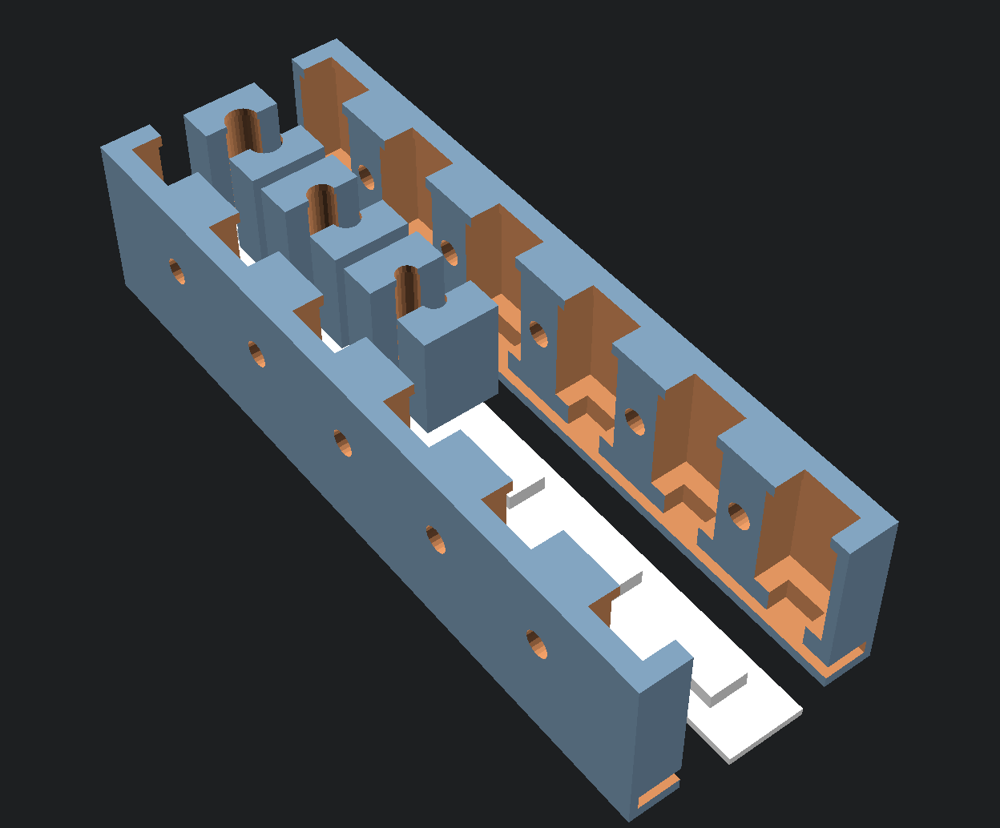

# Fiber Optic Driver

An easy-to-use system to illuminate plastic fiber optic bundles with individually-addressible RGB LEDs.

This project addresses a weird need that I've had for a few projects: needing to light up plastic fibers with programmable LEDs.
This 3D printable housing registers crimped bundles of plastic fibers with standard LED strips.

To use it, first crimp small bundles of 1mm plastic fibers with unshrouded wire ferrules and a hex crimper.
I've found that with 1mm fibers, I was able to get the following bundle sizes:

* 10AWG — 6-7 fibers
* 12AWG — 4-5 fibers
* 14AWG — 2-3 fibers
* 18AWG — 1 fiber

Make sure to get ferrules of the appropriate length. I standardized on 12mm.

For the LED strip, I'm using a 60/m strip of SK9822 LEDs. For fibers, it's important to use SK9822 or APA102
as the tiny point light sources of the fiber ends really show slow PWM like the 450Hz of the WS2811s. I wouldn't
recommend anything below 2kHz PWM frequency.
